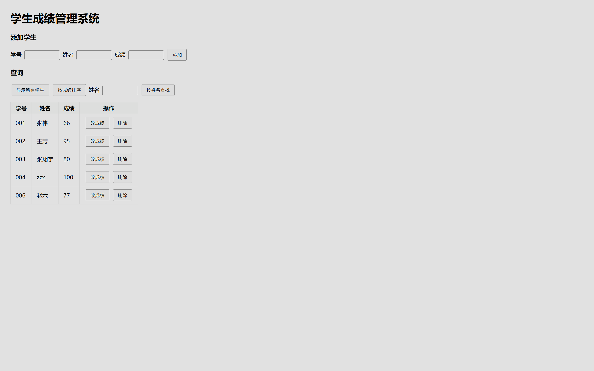

# 🎓 学生成绩管理系统（Spring Boot 版）

基于 **Spring Boot + MySQL** 的学生成绩管理系统后端，采用 **Controller / Service / Dao 三层架构**，对外提供 RESTful 接口，并自带网页操作界面。



## ✨ 功能

- 学生信息**增删改查**（新增 / 按学号查询 / 按姓名查询 / 修改成绩 / 删除）
- 全部学生列表、**按成绩降序排列**
- 资源不存在时返回标准 **404 Not Found**
- 自带网页界面，浏览器即可完成全部操作

## 🔌 接口一览

| 功能 | 接口 | 方法 |
|---|---|---|
| 查询全部学生 | `/students` | GET |
| 按学号查询 | `/students/{id}` | GET |
| 按姓名查询 | `/students/search?name=xxx` | GET |
| 按成绩降序排列 | `/students/sort` | GET |
| 添加学生 | `/students` | POST（JSON body） |
| 修改成绩 | `/students/{id}/score?score=xx` | PUT |
| 删除学生 | `/students/{id}` | DELETE |

## 🧱 技术栈

| 分类 | 技术 |
|---|---|
| 语言 / 框架 | Java 25、Spring Boot 4.1.1、Spring MVC、Spring JDBC |
| 数据库 | MySQL 8（HikariCP 连接池） |
| 构建 / 工具 | Maven、Git |
| 前端 | 原生 HTML + Fetch API |

## 🚀 快速开始

### 1. 初始化数据库

```sql
CREATE DATABASE IF NOT EXISTS score_db;
USE score_db;
CREATE TABLE IF NOT EXISTS student (
    id    VARCHAR(10) PRIMARY KEY,
    name  VARCHAR(20),
    score DOUBLE
);
```

### 2. 配置数据库连接

修改 `src/main/resources/application.properties`：

```properties
spring.datasource.url=jdbc:mysql://localhost:3306/score_db?useSSL=false&serverTimezone=Asia/Shanghai&characterEncoding=utf8
spring.datasource.username=root
spring.datasource.password=你的密码
```

### 3. 启动

运行 `src/main/java/com/example/scoresystem/ScoreSystemApplication.java`，
控制台出现 `Tomcat started on port 8080` 即启动成功。

### 4. 使用

- **网页界面**：浏览器打开 <http://localhost:8080/>
- **接口调用**：

```bash
# 查询全部
curl.exe http://localhost:8080/students

# 添加学生
curl.exe -X POST http://localhost:8080/students \
  -H "Content-Type: application/json" \
  -d "{\"id\":\"007\",\"name\":\"小明\",\"score\":88.5}"

# 修改成绩
curl.exe -X PUT "http://localhost:8080/students/007/score?score=90"

# 删除学生
curl.exe -X DELETE http://localhost:8080/students/007
```

## 📁 项目结构

```
src/main/java/com/example/scoresystem/
├── ScoreSystemApplication.java   启动类
├── Student.java                  实体类
├── StudentController.java        控制层：接收 HTTP 请求、返回响应
├── StudentService.java           业务层接口
├── StudentServiceImpl.java       业务层实现
├── StudentDao.java               数据层接口
└── StudentDaoImpl.java           数据层实现（JdbcTemplate + RowMapper）
src/main/resources/
├── application.properties        配置（数据库连接）
└── static/index.html             网页界面
```

**分层调用链**：

```
浏览器 / curl  →  Controller  →  Service  →  Dao  →  MySQL
                  接收请求        业务逻辑     数据访问
```

## 📈 版本演进

| 版本 | 形态 | 说明 |
|---|---|---|
| **v1.0** | Java + JDBC 控制台程序 | 命令行菜单实现增删改查，启动自动加载数据、增删改实时同步数据库 |
| **v2.0** | Spring Boot 三层架构 RESTful 后端 | 重构为 Controller/Service/Dao 分层 + RESTful 接口 + 网页界面，**功能零回归** |

**v2.0 的两处关键改进**：

1. **架构分层**：从"所有逻辑写在一个类里"改为三层架构，各层职责单一；层间通过接口通信 + 依赖注入（`@Autowired`），便于替换实现与测试。
2. **安全修复**：v1.0 使用字符串拼接 SQL，存在 **SQL 注入**风险（如姓名输入 `张三'); DROP TABLE student;--` 会删除整张表）；v2.0 全部改用 `?` 参数化占位符，从根本上消除该隐患。

## ❓ 常见问题

| 现象 | 原因 / 解决 |
|---|---|
| `Port 8080 already in use` | 8080 被其他程序占用，先停掉它 |
| 连接数据库失败 | 检查 MySQL 服务、账号密码、`score_db` 是否已创建 |
| 改了代码不生效 | Spring Boot 不会自动热加载，需重启程序 |
| 页面能打开但接口报错 | 按 `F12` 打开浏览器 Network 面板，查看请求的真实状态码与路径 |
